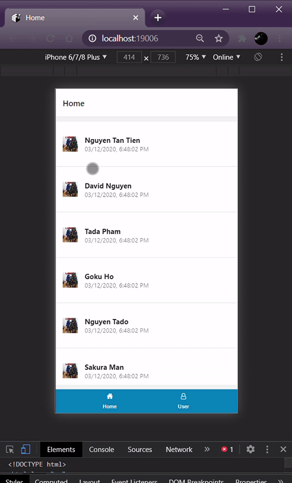

## REACT NATIVE TEMPLATE MATERIAL BOTTOM TABS V5



#### STEP BY STEP
+ STEP 1
```
    git clone git@github.com:tienntps09110/react-native-material-bottom-tabs-v5.git

    yarn install
```

+ STEP 2
```
    CHOOSE HOW TO OPEN
    - yarn start
    - expo start
    - expo start --android
    - expo start --ios
    - expo start --web
    - expo web
    - expo eject
```
### MORE
```
- Set lan: set REACT_NATIVE_PACKAGER_HOSTNAME= ip_lan
```

### CONTACT
```
  FB: fb.com/natriwit
  GITHUB: tjennt
  EMAIL: toma.nguyen675@gmail.com
```
